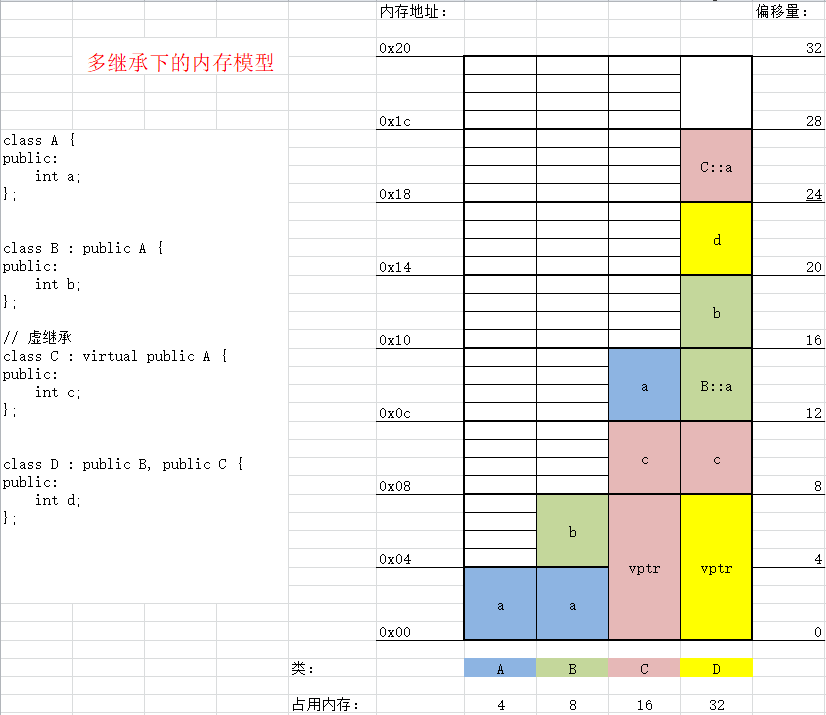

# cpp_study
C++学习教程，总结

## 01-cPlusPlus

C++对C语言的加强

- dm01_helloworld 初识C++
- dm02_namespace 认识C++的命名空间概念
- dm03_variableDefinitions 变量可以随用随定义（没有限制必须将变量在作用域开头定义）
- dm04_registerKeyword C++中的register关键字（可以进行取地址操作）
- dm05_variableCheck C++对变量检测增强
- dm06_struct C++对struct关键字进行功能增强
- dm07_typeCheck C++对变量类型检测增强
- dm08_addBoolTypeKeyword C++新增bool类型
- dm09_ternaryOperator 对三目运算符进行功能增强（可以做左值）
- dm10_constBase const关键字基础介绍

## 02-class

类基础

- dm01_classEncapsulation 类的基本概念及类的封装
- dm02_classSeparateCompilation 类的分离编译
- dm03_objectOriented1 面向对象编程1
- dm04_objectOriented2 面向对象编程2
- dm05_classConstructor1 类的构造函数与析构函数基础
- dm05_classConstructor2 构造函数的分类
- dm05_classConstructor3 默认构造函数和默认拷贝构造函数
- dm05_classConstructorCopy12 拷贝构造函数应用场景，用一个对象初始化另外一个对象
- dm05_classConstructorCopy3 拷贝构造函数的第3种应用场景，对象作为函数参数
- dm05_classConstructorCopy4 拷贝构造函数的第4种应用场景，对象作为函数返回值
- dm05_classConstructorSummarizing 构造函数的调用规则
- dm06_deepCopy 类的深浅拷贝
- dm07_constructorInitializerList 构造函数的初始化列表
- dm08_constructorSummary1 强化训练1: 构造函数-析构函数调用顺序 匿名对象的生命周期
- dm09_constructorSummary2 强化训练2: 构造函数中调用构造函数 （产生匿名对象）
- dm10_new_delete1 C++中的 new delete基础知识
- dm11_new_delete2 深入分析new和delete
- dm12_static 类中的static关键字
- dm13_objectOrientedModel1 面向对象模型初探
- dm14_objectOrientedModel2 面向对象模型剖析
- dm15_this_point 学习this指针
- dm16_friend_function 友元函数
- dm17_friend_class 友元类
- dm18_operator_overloading_1 运算符重载入门技术推演
- dm19_operator_overloading_2 运算符重载的两种方法
- dm20_operator_overloading_3 一元运算符重载++ --
- dm21_operator_overloading_4 运算符重载整理
- dm22_operator_overloading_5 友元函数定义运算符重载<<
- dm23_operator_overloading_6 运算符重载=
- dm24_operator_overloading_7 运算符重载[] == !=
- dm25_operator_overloading_8 运算符重载() bool !
- dm26_operator_overloading_9 运算符重载&& ||
- dm27_mystring 实现一个MyString类

## 03-inheritance

类的继承

- dm01_definition 类继承的定义
- dm02_access 类继承中的访问控制
- dm03_principle_of_compatibility 类继承中的兼容性原则
- dm04_继承中的构造与析构
- dm05_继承与组合下的构造与析构
- dm06_继承中的同名成员变量和函数
- dm07_继承中的static关键字
- dm08_多继承
- dm09_多继承的二义性和虚继承的解决方案
- dm10_多继承原理抛转
- dm11_类型兼容性原则遇上函数重写
- dm12_多态案例
- dm13_虚析构函数
- dm14_重载重写重定义
- dm15_多态原理探究
- dm16_证明vptr指针的存在
- dm17_vptr指针的分步初始化

## 04-template

函数模板与类模板

- dm01_函数模板语法基础
- dm02_函数模板做函数参数强化
- dm03_函数模板遇上函数重载
- dm04_函数模板和普通函数在一起的调用规则
- dm05_编译器实现模板机制剖析
- dm06_类模板基础及单个类模板语法
- dm07_继承中的类模板语法
- dm08_复数类_成员函数在类内部
- dm09_复数类_成员函数在同一个文件的类的外部
- dm10_复数类_分离编译
- dm11_类模板中的static关键字

## 06-boost

Boost官网<https://www.boost.org>

### build

```shell script
wget https://dl.bintray.com/boostorg/release/1.69.0/source/boost_1_69_0.tar.gz -O boost_1_69_0.tar.gz
tar -xvf boost_1_69_0.tar.gz
cd boost_1_69_0
./bootstrap.sh
./b2 --with-date_time --with-timer install
```

####  Display the list of Boost libraries
```shell script
./b2  --show-libraries
```

### cmake

```shell script
cmake --help-module FindBoost
```

## 07-spdlog

日志库
<https://github.com/gabime/spdlog>

### build
```shell script
wget https://github.com/gabime/spdlog/archive/v1.3.1.tar.gz -O spdlog-1.3.1.tar.gz
tar -xf spdlog-1.3.1.tar.gz
cd spdlog-1.3.1
mkdir build
cd build
cmake -DSPDLOG_BUILD_BENCH=OFF ..
make -j4
sudo make install
```

## 08-cmdline

命令行解析库
<https://github.com/tanakh/cmdline>

## 09-jsoncpp

<https://github.com/open-source-parsers/jsoncpp>

```shell script
apt install libjsoncpp-dev
```

### build

```shell script
wget https://github.com/open-source-parsers/jsoncpp/archive/1.8.4.tar.gz -O jsoncpp-1.8.4.tar.gz
tar -xvf jsoncpp-1.8.4.tar.gz
cd jsoncpp-1.8.4
mkdir build
cd build
cmake -DBUILD_SHARED_LIBS=ON ..
make -j8
make install
```

## 10-mongodb

mongodb 4.0: mongocxx >= 3.4: mongoc >= 1.13.0

### c driver
<https://docs.mongodb.com/ecosystem/drivers/c>

#### install mongoc
<http://mongoc.org/libmongoc/current/installing.html>

Prerequisites for libmongoc

On Debian / Ubuntu:

    sudo apt-get install cmake libssl-dev libsasl2-dev

On RedHat / Fedora:

    sudo yum install cmake openssl-devel cyrus-sasl-devel

```shell script
wget https://github.com/mongodb/mongo-c-driver/releases/download/1.15.2/mongo-c-driver-1.15.2.tar.gz
tar -xvf mongo-c-driver-1.15.2.tar.gz
cd mongo-c-driver-1.15.2
mkdir cmake-build
cd cmake-build
cmake -DENABLE_AUTOMATIC_INIT_AND_CLEANUP=OFF -DCMAKE_BUILD_TYPE=Release ..
make -j8
make install
ldconfig
pkg-config --cflags --libs libmongoc-1.0
pkg-config --cflags --libs libbson-1.0
```

### c++ driver
<https://docs.mongodb.com/ecosystem/drivers/cxx>

### install mongocxx
<http://mongocxx.org/mongocxx-v3/installation>

```shell script
wget https://github.com/mongodb/mongo-cxx-driver/archive/r3.4.0.tar.gz -O mongo-cxx-driver-r3.4.0.tar.gz
tar -xvf mongo-cxx-driver-r3.4.0.tar.gz
cd mongo-cxx-driver-r3.4.0
cd build
cmake -DCMAKE_BUILD_TYPE=Release -DCMAKE_INSTALL_PREFIX=/usr/local ..
make -j8
make install
ldconfig
pkg-config --cflags --libs libmongocxx
```

<!--
## 深度探索

### 多继承中的内存模型


-->

## update cmake

```shell script
wget https://github.com/Kitware/CMake/releases/download/v3.15.5/cmake-3.15.5.tar.gz
tar -xvf cmake-3.15.5.tar.gz
cd cmake-3.15.5
```

### cmake build

```shell script
mkdir build
cd build
cmake ..
make -j8
make install
```

### not installed cmake

```shell script
./bootstrap
make -j8
make install
```
